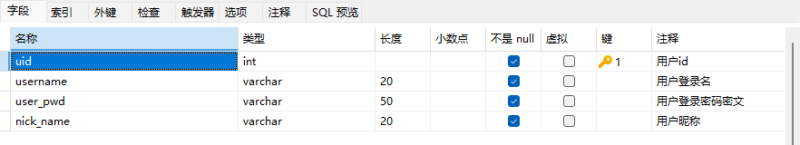
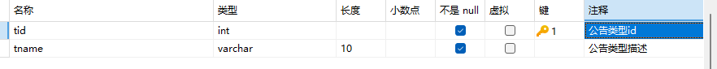
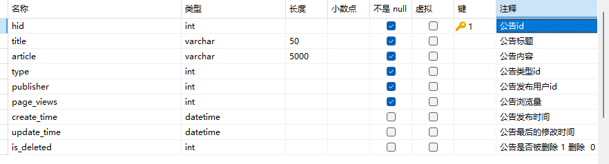
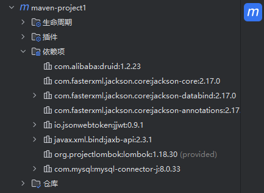
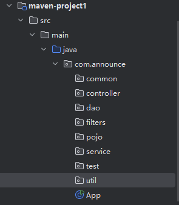
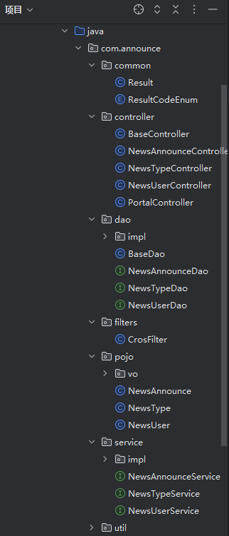

# Web俱乐部公告网页端项目初步开发手册

Web俱乐部的公告发布平台，注册的用户登录之后可以发布公告，初步完成。

可直接克隆后进行前后端运行。

前端使用vue3-vite（为了节省空间删除依赖包，运行前请npm i）

后端使用Apache-Tomcat 10

## 1、项目简介

### 1.1 项目需求

+ 用户功能
  + 注册功能
  + 登录功能
  + 向管理员发送疑问与建议
  + 发送待管理员审核的公告（项目招募、协作等）
+ 管理员
  + 登录功能
+ 公告
  + 新闻的分页浏览
  + 通过标题关键字搜索公告
  + 查看公告详情
  + 公告的修改和删除
+ 权限控制
  + 用户只能修改和自己发布的公告
  + 管理员能修改所有发布的公告

### 1.2 技术栈

#### 前端

+ ES6作为基础JS语法
+ nodejs用于运行环境
+ npm用于项目依赖管理工具
+ vite用于项目的构建架工具
+ Vue3用于项目数据的渲染框架
+ Axios用于前后端数据的交互
+ Router用于页面的跳转
+ Pinia用于存储用户的数据
+ LocalStorage作为用户校验token的存储手段
+ Element-Plus提供组件

#### 后端

+ JAVA作为开发语言,版本为JDK17
+ Tomcat作为服务容器,版本为10.1.26
+ Mysql8用于项目存储数据
+ Servlet用于控制层实现前后端数据交互
+ JDBC用于实现数据的CURD
+ Druid用于提供数据源的连接池
+ MD5用于用户密码的加密
+ Jwt用于token的生成和校验
+ Jackson用于转换JSON
+ Filter用于用户登录校验和跨域处理
+ Lombok用于处理实体类
+ Maven项目管理

## 2、前端搭建

## 3、后端搭建

### 3.1 数据库

`news_users` 用户表

`news_type` 类型表

`news_announce` 信息表

### 3.2 后端初步搭建

#### 3.2.1 依赖包导入

#### 3.2.2 MVC架构模式

##### 准备包结构

+ controller  控制层代码,主要由Servlet组成
+ service     服务层代码,主要用于处理业务逻辑
+ dao          数据访问层,主要用户定义对于各个表格的CURD的方法
+ pojo         实体类层,主要用于存放和数据库对应的实体类以及一些VO对象
+ util           工具类包,主要用存放一些工具类
+ common  公共包,主要用户存放一些其他公共代码
+ filters       过滤器包,专门用于存放一些过滤器

#### 3.2.3 工具类

Result类 : 用于标准化 API 接口的返回结果，包含返回码、返回消息和返回数据

ResultCodeEnum 枚举类 : 枚举返回码

MD5加密 : 加密用户密码

JDBCUtil连接池

JwtHelper

JSON转换

#### 3.2.4 各层的接口和实现类

- 实体类和VO对象
- DAO层接口和实现类
- Service层接口和实现类
- Controller层接口和实现类
- 开发跨域CORS过滤器

## 4、测试工具

接口测试工具 PostMan

### 4.1 安装

[Postman: The World's Leading API Platform | Sign Up for Free](https://www.postman.com/)

